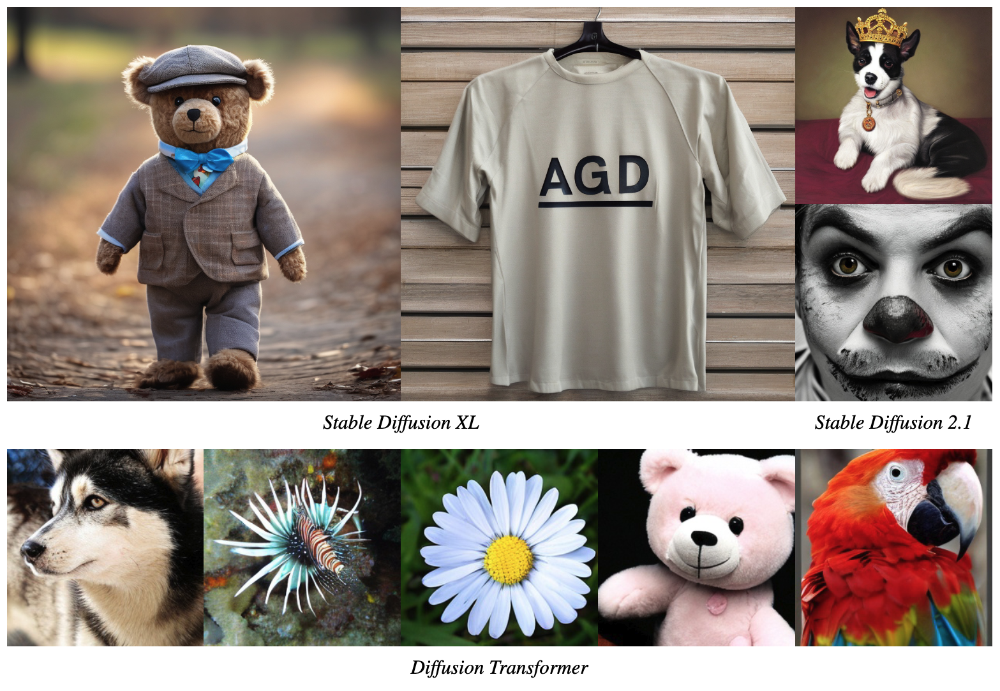
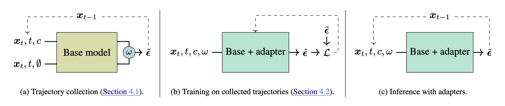

# Adapter Guidance Distillation ([📝 Paper](https://arxiv.org/abs/2503.07274))



While classifier-free guidance (CFG) is essential for conditional diffusion models, it doubles the number of neural function evaluations (NFEs) per inference step. To mitigate this inefficiency, we introduce adapter guidance distillation (AGD), a novel approach that simulates CFG in a single forward pass. AGD leverages lightweight adapters to approximate CFG, effectively doubling the sampling speed while maintaining or even improving sample quality. Unlike prior guidance distillation methods that tune the entire model, AGD keeps the base model frozen and only trains minimal additional parameters (∼2%) to significantly reduce the resource requirement of the distillation phase. Additionally, this approach preserves the original model weights and enables the adapters to be seamlessly combined with other checkpoints derived from the same base model. We also address a key mismatch between training and inference in existing guidance distillation methods by training on CFG-guided trajectories instead of standard diffusion trajectories. Through extensive experiments, we show that AGD achieves comparable or superior FID to CFG across multiple architectures with only half the NFEs. Notably, our method enables the distillation of large models (∼2.6B parameters) on a single consumer GPU with 24 GB of VRAM, making it more accessible than previous approaches that require multiple high-end GPUs.

## Acknowledgement

This codebase builds upon [the Diffusion Transformer repository](https://github.com/facebookresearch/DiT) and [the diffusers library](https://github.com/huggingface/diffusers).

## Usage

See [the paper](https://arxiv.org/abs/2503.07274) for details on the method and experiments. All commands have a `--help` flag to show the available options.



### Sampling training trajectories

Diffusion Transformer:
```bash
python -m agd.dit.sample_trajectories --output-dir /path/to/trajectories
```

Stable Diffusion 2.1:
```bash
python -m agd.sd.sample_trajectories --output-dir /path/to/trajectories --base-model stabilityai/stable-diffusion-2-1 --prompt-file prompts/coco2017_train_subset.txt --inference-steps 999
```

Stable Diffusion XL:
```bash
python -m agd.sd.sample_trajectories --output-dir /path/to/trajectories --base-model stabilityai/stable-diffusion-xl-base-1.0 --prompt-file prompts/coco2017_train_subset.txt --inference-steps 1000
```

### Training adapters

Diffusion Transformer:
```bash
python -m agd.dit.train --dir /path/to/results --data-path /path/to/trajectories <...options>
```

Stable Diffusion 2.1:
```bash
python -m agd.sd.train --dir /path/to/results --data-path /path/to/trajectories --base-model stabilityai/stable-diffusion-2-1 <...options>
```

Stable Diffusion XL:
```bash
python -m agd.sd.train --dir /path/to/results --data-path /path/to/trajectories --base-model stabilityai/stable-diffusion-xl-base-1.0 <...options>
```

### Sampling with adapters

Diffusion Transformer:
```bash
python -m agd.dit.sample --dir /path/to/results <...options>
```

Stable Diffusion 2.1/XL:
```bash
python -m agd.sd.sample --dir /path/to/results --prompt <prompt> <...options>
```

### Calculating metrics

Diffusion Transformer:
```bash
python -m agd.dit.calculate_metrics --dir /path/to/results --ref /path/to/ref_samples <...options>
```

Stable Diffusion 2.1/XL:
```bash
python -m agd.sd.calculate_metrics --dir /path/to/results --ref /path/to/ref_samples <...options>
```

## Citation

```bib
@article{jensen2025efficient,
  title={Efficient Distillation of Classifier-Free Guidance using Adapters},
  author={Jensen, Cristian Perez and Sadat, Seyedmorteza},
  journal={arXiv preprint arXiv:2503.07274},
  year={2025}
}
```
